<!-- ===== HERO BANNER (theme-aware) ===== -->
<picture>
  <source media="(prefers-color-scheme: dark)" srcset="./dark.svg">
  <source media="(prefers-color-scheme: light)" srcset="./light.svg">
  
</picture>

**B.Tech Computer Engineering · R.C. Patel Institute of Technology, Shirpur · 📍 Maharashtra, India**

<!-- ===== ABOUT ===== -->

## ⚡ About

- Building scalable full-stack applications with **Spring Boot + React.js**
- Focused on **backend development, microservices, and cloud-native architecture**
- Currently learning **Spring Cloud, Docker, Apache Kafka, Keycloak, and AI integration**
- **1000+** problems solved and a **100-day streak** on CodeChef

<!-- ===== DIVIDER ===== -->
<picture>
  <source media="(prefers-color-scheme: dark)" srcset="./divider-dark.svg">
  <source media="(prefers-color-scheme: light)" srcset="./divider-light.svg">
  
</picture>

<!-- ===== TECH STACK ===== -->

## 🛠 Tech Stack

 

<picture>
  <source media="(prefers-color-scheme: dark)" srcset="./learning-dark.svg">
  <source media="(prefers-color-scheme: light)" srcset="./learning-light.svg">
  
</picture>

<!-- ===== DIVIDER ===== -->
<picture>
  <source media="(prefers-color-scheme: dark)" srcset="./divider-dark.svg">
  <source media="(prefers-color-scheme: light)" srcset="./divider-light.svg">
  
</picture>

<!-- ===== GITHUB STATS ===== -->

## 📊 GitHub Stats

<picture>
  <source media="(prefers-color-scheme: dark)" srcset="https://github-readme-stats.vercel.app/api?username=Aakash162005&show_icons=true&count_private=true&include_all_commits=true&hide_rank=true&hide_border=true&title_color=22D3EE&icon_color=A78BFA&text_color=94A3B8&bg_color=0A101F" />
  
</picture>
<picture>
  <source media="(prefers-color-scheme: dark)" srcset="https://github-readme-stats.vercel.app/api/top-langs/?username=Aakash162005&layout=compact&langs_count=8&hide_border=true&title_color=22D3EE&text_color=94A3B8&bg_color=0A101F" />
  
</picture>

 

<picture>
  <source media="(prefers-color-scheme: dark)" srcset="https://github-readme-activity-graph.vercel.app/graph?username=Aakash162005&bg_color=0A101F&color=94A3B8&line=22D3EE&point=A78BFA&area_color=22D3EE&area=true&hide_border=true" />
  
</picture>

<!-- ===== CONTRIBUTION SNAKE ===== -->

## 🐍 Contribution Snake

<picture>
  <source media="(prefers-color-scheme: dark)" srcset="https://raw.githubusercontent.com/Aakash162005/Aakash162005/output/snake-dark.svg" />
  <source media="(prefers-color-scheme: light)" srcset="https://raw.githubusercontent.com/Aakash162005/Aakash162005/output/snake-light.svg" />
  
</picture>

<!-- ===== DIVIDER ===== -->
<picture>
  <source media="(prefers-color-scheme: dark)" srcset="./divider-dark.svg">
  <source media="(prefers-color-scheme: light)" srcset="./divider-light.svg">
  
</picture>

<!-- ===== PROJECTS ===== -->

## 🚀 Projects

<!-- Flagship -->

<table>
<tr><td>

### 🌾 AgroConnect &nbsp;·&nbsp; <i>Flagship</i>

> **AI-powered agricultural marketplace** connecting farmers and agri-vendors at scale

- 🤖 Gemini AI for smart crop, fertilizer & pesticide recommendations
- 🔐 Keycloak + JWT dual-layer authentication & role-based access
- 📡 Event-driven architecture with Apache Kafka for real-time order processing
- 🐳 Fully containerised with Docker; Spring Cloud for service discovery & config

`Spring Boot` `React` `PostgreSQL` `Kafka` `Docker` `Keycloak` `Spring Cloud` `Gemini AI`

</td></tr>
</table>

<picture>
  <source media="(prefers-color-scheme: dark)" srcset="https://github-readme-stats.vercel.app/api/pin/?username=Aakash162005&repo=AgroConnect&hide_border=true&title_color=22D3EE&icon_color=A78BFA&text_color=94A3B8&bg_color=0A101F" />
  
</picture>
<picture>
  <source media="(prefers-color-scheme: dark)" srcset="https://github-readme-stats.vercel.app/api/pin/?username=Aakash162005&repo=SkillBridge&hide_border=true&title_color=22D3EE&icon_color=A78BFA&text_color=94A3B8&bg_color=0A101F" />
  
</picture>

<picture>
  <source media="(prefers-color-scheme: dark)" srcset="https://github-readme-stats.vercel.app/api/pin/?username=Aakash162005&repo=Alumni-Network-Platform&hide_border=true&title_color=22D3EE&icon_color=A78BFA&text_color=94A3B8&bg_color=0A101F" />
  
</picture>
<picture>
  <source media="(prefers-color-scheme: dark)" srcset="https://github-readme-stats.vercel.app/api/pin/?username=Aakash162005&repo=KisanMate&hide_border=true&title_color=22D3EE&icon_color=A78BFA&text_color=94A3B8&bg_color=0A101F" />
  
</picture>

<picture>
  <source media="(prefers-color-scheme: dark)" srcset="https://github-readme-stats.vercel.app/api/pin/?username=Aakash162005&repo=OfferBazaar&hide_border=true&title_color=22D3EE&icon_color=A78BFA&text_color=94A3B8&bg_color=0A101F" />
  
</picture>
<picture>
  <source media="(prefers-color-scheme: dark)" srcset="https://github-readme-stats.vercel.app/api/pin/?username=Aakash162005&repo=Apna-Bank&hide_border=true&title_color=22D3EE&icon_color=A78BFA&text_color=94A3B8&bg_color=0A101F" />
  
</picture>

<b>📋 Project Details</b>

 

| Project | What it does | Stack |
|---------|-------------|------|
| 🎯 **SkillBridge** | AI resume analyzer — personalized skill recommendations and career paths | React · Spring Boot · MySQL · AI APIs |
| 🎓 **Alumni Network** | Student-alumni networking — role-based auth, jobs board, admin dashboard | Spring Boot · JWT · MySQL · JS |
| 🌿 **KisanMate** | Farmer platform — tools, seeds, weather info, subsidy awareness | Java · Spring MVC · SQL |
| 🛍️ **OfferBazaar** | Vendor offers aggregator — engagement dashboards; ~40% improved vendor visibility | Servlets · SQL |
| 🏦 **Apna Bank** | Banking system — full CRUD for customers, accounts, transactions | Servlets · MySQL |

<!-- ===== EXPERIENCE ===== -->

## 💼 Experience

**Full Stack Developer Intern — CodexConquer** · *Feb 2026 – May 2026*
Built frontend and backend modules, designed REST APIs, integrated relational databases, and collaborated through Git/GitHub.

**Java Developer Training — R3 Systems India Pvt. Ltd., Nashik**
Enterprise Java with Spring MVC, Hibernate, and MySQL; MVC architecture and database design.

<!-- ===== CERTIFICATIONS ===== -->

## 🏅 Certifications

☕ **Java Programming** — CodeChef &nbsp;·&nbsp; 🐍 **Python Programming** — CodeChef

<!-- ===== DIVIDER ===== -->
<picture>
  <source media="(prefers-color-scheme: dark)" srcset="./divider-dark.svg">
  <source media="(prefers-color-scheme: light)" srcset="./divider-light.svg">
  
</picture>

<!-- ===== CONNECT ===== -->

## 🤝 Connect

&nbsp;

&nbsp;

&nbsp;

  

<!-- ===== FOOTER ===== -->

<picture>
  <source media="(prefers-color-scheme: dark)" srcset="https://capsule-render.vercel.app/api?type=waving&color=0:0A101F,50:1B2A4A,100:0A101F&height=120&section=footer&animation=twinkling">
  
</picture>
